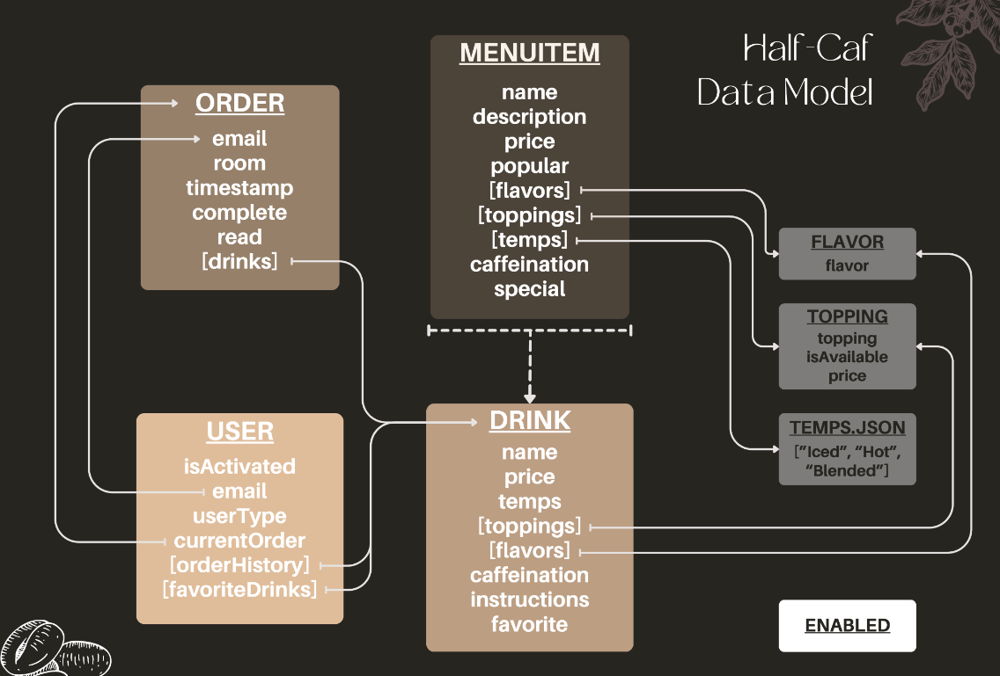

# Half Caf App

Group Members (2020-2021): Nathan, Naglis, David, Aadi

Group Members (2021-2022): Grace, Jessica, Kasey, Owen

Group Members (2022-2023): Divya, Hansheng, Krish, Sophia

Group Members (2023-2024): Tavneet, Abby, Delilah, Eric

Group Members (2024-2025): Bennett, Emran, Jack, Ryan

## Insights (Previous Group)

- Copilot is a great tool for solving problems and building features. However, it is important that you fully understand the code before you implement it. Blindly "vibe coding" will lead to bad code and a larger mess which will take even more time to resolve.
- Trello is very important. Even though it may seem tedious, it is necessary to ensure proper organization and teamwork.
- Pair programming is the greatest tool you have. Before asking copilot or google, ask your teammates. Additionally, if somebody doesn't have a task, they MUST be pair programming.
- It is important to follow these GitHub best practices: pull requests must be reviewed by another member who will then merge it. Branches should clearly explain the feature. Delete the branch after merging. 

## Platform Requirements

Install Node.js

## Initial Setup

1. Clone this repository
2. From a terminal in the repository's directory, run the following command to install all dependencies:

```
npm install
```

3. Create a .env file in the root directory

```
CLIENT_ID= <find in trello>
MONGO_URI= <find in trello>
SESSION_SECRET= <secret key>
PORT_NUM = 8080 (can change)
VAPID_PUBLIC_KEY= <find in trello>
VAPID_PRIVATE_KEY= <find in trello>
```

4. Download MongoDB Compass for your computer
5. Use the URI from the Trello to connect to the database
6. In Compass, edit one of the ADMIN users and change their email to your email
7. Run the server from the VS Code debugger
8. Go to a web browser and type in localhost:PORT_NUM or click the link displayed in terminal
9. Go to Login and sign in with Google
10. Now you are on the add user page so add everyone else in your group as a user

## Architecture

MongoDB - Database\
Node.js - Server\
Mongoose - Creates a connection between MongoDB and the Node.js JavaScript runtime environment\
Javascript - Used both on client and server side\
EJS - Embedded JS, similar to HTML, only client side\
CSS - Styling, only client side\
Three.js - Renders 3D models on the web\
Chart.js - Renders charts in the metrics page

## Data Schema


(OUTDATED!)

The image above shows the dependencies of the different classes in the dat structure. All of the models are written in js except temps.json (you can find the data model under assets/server/model). Download MongoDB Compass to easily access the database with the same URI written in your ejs file. You can look through Compass to see what the dependencies look like in the actual app.

To explain the image more, each arrow shows a different dependency. The beginning of the arrow starts at the property that needs information from a different class, which is where the head of the arrow points to. The dotted line and arrow that goes from menuItem to drink is because every time the user clicks on a drink from the menu page, a new instance of drink is created. Drink is supposed to be a customized version of menuItem. The dotted arrow shows that drink is not directly dependent on menuItem in the database, but pulls from its properties when a new drink is created. That's because menuItems don't reference all of the toppings or flavors so no one can order a blue raspberry coffee, so only certain flavors, toppings, and temperatures are available for each menuItem and drink.

Enabled is on it's own because it's a separate class. That is the boolean value that the app references to see if ordering is turned on or off. During passing periods or outside of the Half Caf's hours, the baristas and admin can turn ordering off to prevent people from ordering and waiting for a drink that's not being made. Enabled uses a Websocket to check and see if it's been updated every second, and if it has, it reloads every page to either disable ordering or to sync the slider on the admin and barista side.

## Features the 2025-2026 team needs to implement:

1. Inventory System

## Google Authentication Implementation

### Overview

This Node.js application integrates Google Authentication using the Google Sign-In API. It ensures that only authenticated users can access specific routes based on their roles. The application comprises several components: server-side middleware for session handling, server-side and client-side handlers for Google Sign-In, and view templates for rendering the authentication UI.

### `server.js` (Middleware Setup)

This is the core of the application's backend. It includes middleware that checks if a user is logged in before allowing access to certain routes. If a user's session does not have an email stored (`req.session.email` is undefined), they are redirected to the `/auth` page for authentication. This prevents unauthorized access to sensitive routes. The middleware specifically allows unrestricted access to public endpoints like "/homePopularDrinks" and "/homeMenu".

### `auth.js` (Google Authentication Routes)

The auth.js file handles the actual authentication process:\

- It defines routes that the frontend can communicate with to perform authentication tasks.
- When the frontend sends the ID token (received from Google after a user logs in), auth.js verifies this token using Google's libraries.
- If the verification is successful, it stores the user's email in the session, effectively logging them in.

### `auth2.js` (Client-Side Authentication Logic)

The auth2.js script runs in the user's browser and handles:\

- The receipt of the authentication response from Google (which includes the ID token).
- It sends this token to the server (/auth route) via a POST request.
- Upon confirmation of successful authentication, it redirects the user to the /redirectUser route.

### `router.js` (Role-Based Redirection)

After authentication, router.js takes over:\

- It defines a route /redirectUser which checks the user's role based on the email stored in the session.
- Depending on the role fetched from the database (admin, barista, teacher), it redirects the user to the appropriate route.

### Authentication View (`auth.ejs`)

The `auth.ejs` file is the front-end component where users interact with Google's Sign-In service. It includes:

- An image placeholder.
- Google's JavaScript library for authentication.
- A div configured with `data-client_id` and `data-callback` which triggers `handleCredentialResponse` after successful authentication.

This file is crucial for initiating the authentication flow from the client's browser.

### Flow of Control:

1. User Visits the Site: They attempt to access a protected route.
2. Middleware Check: server.js checks if the user is authenticated.
3. Redirection: If not authenticated, the user is redirected to the /auth route, loading auth.ejs.
4. User Action: The user clicks the Google Sign-In button on auth.ejs.
5. Token Acquisition: Google returns an ID token upon successful login, which auth2.js captures.
6. Token Verification: auth2.js sends this token to the server via the route defined in auth.js.
7. Session Update: Upon successful token verification, the user’s email is stored in the session.
8. Role-Based Redirection: The user is then redirected to /redirectUser, where router.js checks the user's role and redirects them accordingly.
